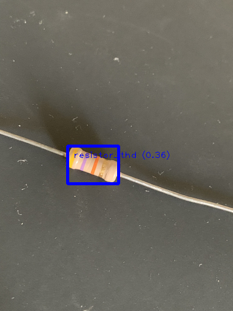

# ElectrAI

ElectrAI is an AI for detecting electronic components such as resistors. 
[Tensorflow's Colaboratory Notebook](https://colab.research.google.com/github/khanhlvg/tflite_raspberry_pi/blob/main/object_detection/Train_custom_model_tutorial.ipynb) was used as a template to this one.

### Capability

Unfortunately, this model isn't good at doing its job at all. This could be due to the limited dataset or processing power. 
Disclaimer: the following image and its detection parameters are cherry-picked.

### Try it out

You can experiment and try it out yourself in [this Colab Notebook](https://colab.research.google.com/drive/1CR18fFD7r2XEHgFH00uNEu4eELxWT0Q7?usp=sharing). 
If it isn't available anymore you can import [this file](colab/Model%20Maker%20Object%20Detection%20for%20Electrical%20Components) directly to Google Colaboratory.

### Use cases

- Scanner/detection app
- Product quality control/verification
